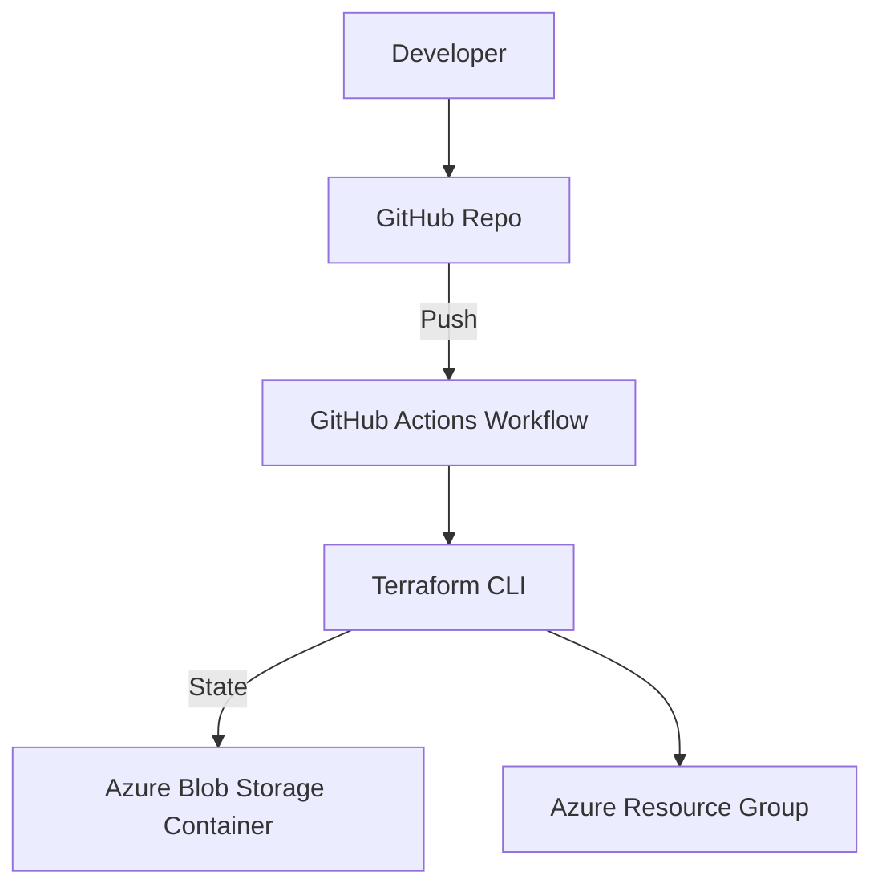

# Project 2: Terraform Remote State + CI/CD (Azure)

## Overview
This project demonstrates how to manage **remote Terraform state** in Azure and automate infrastructure deployments with a **GitHub Actions CI/CD pipeline**.  

It builds on [Project 1](../terraform-azure-vm-nginx) and lays the foundation for **scalable, team-ready infrastructure as code**.  

---

## What This Project Provisions
- **Azure Resource Group** for demo workloads
- **Remote backend** (Azure Storage Account + Container) to store Terraform state securely
- **Service Principal** with least-privilege roles:
  - `Contributor` (for provisioning)
  - `Storage Blob Data Contributor` (for remote state access)
- **GitHub Actions Pipeline** (`.github/workflows/terraform.yml`) to run:
  - `terraform fmt` (formatting)
  - `terraform validate` (syntax check)
  - `terraform plan` (execution preview)
  - `terraform apply` (auto-approve on main branch)

---

## Architecture Diagram

